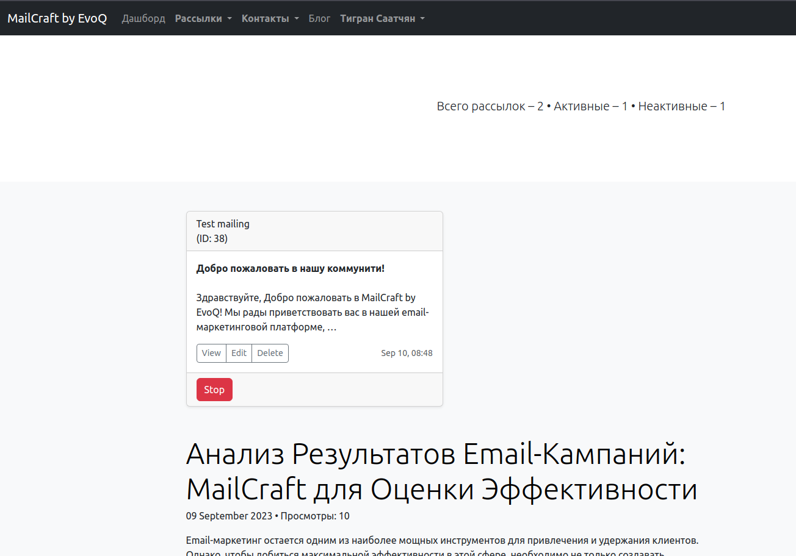

<h1 align="center">MailCraft by EvoQ</h1>

<h4 align="center">Simple and Powerful Email Marketing Platform.</h4>

<p align="center">
  <a href="https://github.com/tigran-saatchyan/mailcraft-by-evoq/blob/master/LICENSE"></a>
  <a href="https://t.me/PythonistiC"></a>
  <a href="https://www.paypal.me/TigranSaatchyan"></a>
</p>


<p align="center">
  
</p>


## Table of Contents

* [Background / Overview](#background--overview)
* [Features](#features)
* [Prerequisites](#prerequisites)
  * [Installation](#installation)
  * [Setting up](#setting-up)
  * [Structure / Scaffolding](#structure--scaffolding)
* [Documentation](#documentation)
* [Browser Support](#browser-support)
* [Dependencies](#dependencies)
* [Todo](#todo)
* [Release History](#release-history)
* [Changelog](#changelog)
* [Issues](#issues)
* [Bugs](#bugs)
* [Translations](#translations)
* [Authors](#authors)
* [Acknowledgments](#acknowledgments)
* [Support](#support)
* [License](#license)

## Background / Overview

MailCraft by EvoQ is a powerful web application designed to streamline and enhance 
your email marketing strategy. Our application provides you with intuitive tools to 
create creative and personalized emails, manage your contacts, and efficiently track 
campaign results. Whether you're a novice marketer or an experienced professional, 
MailCraft will help you achieve greater ROI from your email campaigns.

## Features

* Contact List Management
  * Contacts
  * Lists of contacts
* Automation
  * Mailing automation

## Prerequisites

You will need the following installed on your computer.

* [Git](https://git-scm.com/)
* [Python Poetry](https://python-poetry.org/)

### Installation

Open your terminal and type in

```sh
$ git clone https://github.com/tigran-saatchyan/mailcraft-by-evoq.git
$ cd mailcraft-by-evoq
```

Install all the packages

```sh
$ poetry install
```

### Setting up

Run all migrations
```sh
$ python manage.py migrate
```

Load country list for users
```sh
$ python manage.py load_countries
```
---
* (Optional) Load demo data

```sh
$ python manage.py load_demo_data
```


### Structure / Scaffolding

<details>

<summary>Project Structure</summary>

```text
mailcraft-by-evoq
├── blog
│  ├── __init__.py
│  ├── admin.py
│  ├── apps.py
│  ├── forms.py
│  ├── migrations
│  │  ├── 0001_initial.py
│  │  ├── 0002_initial.py
│  │  └── __init__.py
│  ├── models.py
│  ├── templates
│  │  └── blog
│  │     ├── includes
│  │     │  ├── inc_full_post_card.html
│  │     │  ├── inc_paginator_old_new.html
│  │     │  ├── inc_paginator_pages.html
│  │     │  ├── inc_post_card.html
│  │     │  └── inc_post_head_section.html
│  │     ├── posts_confirm_delete.html
│  │     ├── posts_detail.html
│  │     ├── posts_form.html
│  │     └── posts_list.html
│  ├── tests.py
│  ├── urls.py
│  └── views.py
├── config
│  ├── __init__.py
│  ├── asgi.py
│  ├── settings.py
│  ├── urls.py
│  └── wsgi.py
├── contacts
│  ├── __init__.py
│  ├── admin.py
│  ├── apps.py
│  ├── forms.py
│  ├── migrations
│  │  ├── 0001_initial.py
│  │  ├── 0002_initial.py
│  │  └── __init__.py
│  ├── models.py
│  ├── templates
│  │  └── contacts
│  │     ├── contact
│  │     │  ├── contact_confirm_delete.html
│  │     │  ├── contact_detail.html
│  │     │  ├── contact_form.html
│  │     │  ├── contact_list.html
│  │     │  └── includes
│  │     │     ├── inc_contact_card.html
│  │     │     ├── inc_contact_card_test_modal.html
│  │     │     └── inc_contact_head_section.html
│  │     └── list
│  │        ├── includes
│  │        │  ├── inc_lists_card.html
│  │        │  ├── inc_lists_card_test_modal.html
│  │        │  └── inc_lists_head_section.html
│  │        ├── lists_confirm_delete.html
│  │        ├── lists_detail.html
│  │        ├── lists_form.html
│  │        └── lists_list.html
│  ├── tests.py
│  ├── urls.py
│  └── views.py
├── frontend
│  ├── __init__.py
│  ├── admin.py
│  ├── apps.py
│  ├── forms.py
│  ├── migrations
│  │  └── __init__.py
│  ├── models.py
│  ├── templates
│  │  └── frontend
│  │     ├── base.html
│  │     ├── includes
│  │     │  ├── inc_footer.html
│  │     │  ├── inc_header.html
│  │     │  ├── inc_index_head_section.html
│  │     │  └── inc_menu.html
│  │     └── index.html
│  ├── templatetags
│  │  ├── __init__.py
│  │  └── my_tags.py
│  ├── tests.py
│  ├── urls.py
│  └── views.py
├── LICENSE
├── logs
│  ├── __init__.py
│  ├── admin.py
│  ├── apps.py
│  ├── migrations
│  │  ├── 0001_initial.py
│  │  ├── 0002_initial.py
│  │  └── __init__.py
│  ├── models.py
│  ├── templates
│  │  └── logs
│  │     ├── includes
│  │     │  └── inc_mailings_head_section.html
│  │     ├── logs_confirm_delete.html
│  │     └── logs_detail.html
│  ├── tests.py
│  ├── urls.py
│  └── views.py
├── mailing
│  ├── __init__.py
│  ├── admin.py
│  ├── apps.py
│  ├── cron.py
│  ├── forms.py
│  ├── management
│  │  ├── __init__.py
│  │  └── commands
│  │     ├── __init__.py
│  │     └── send_mail.py
│  ├── migrations
│  │  ├── 0001_initial.py
│  │  ├── 0002_initial.py
│  │  └── __init__.py
│  ├── models.py
│  ├── service.py
│  ├── templates
│  │  └── mailing
│  │     ├── includes
│  │     │  ├── inc_mailing_card.html
│  │     │  ├── inc_mailing_card_test_modal.html
│  │     │  └── inc_mailings_head_section.html
│  │     ├── mailing_confirm_delete.html
│  │     ├── mailing_detail.html
│  │     ├── mailing_form.html
│  │     └── mailing_list.html
│  ├── tests.py
│  ├── urls.py
│  └── views.py
├── manage.py
├── media
│  └── blog
│     └── posts
├── poetry.lock
├── pyproject.toml
├── README.md
├── requirements.txt
├── service
│  ├── __init__.py
│  └── utils.py
├── static
│  ├── blog
│  ├── mailing
│  ├── readme
│  └── users
│     └── data
│        └── countries.json
└── users
   ├── __init__.py
   ├── admin.py
   ├── apps.py
   ├── forms.py
   ├── management
   │  ├── __init__.py
   │  └── commands
   │     ├── __init__.py
   │     ├── create_su.py
   │     └── load_countries.py
   ├── migrations
   │  ├── 0001_initial.py
   │  └── __init__.py
   ├── models.py
   ├── templates
   │  └── users
   │     ├── includes
   │     │  ├── inc_user_card.html
   │     │  └── inv_login_style.html
   │     ├── registration
   │     │  ├── email_verified.html
   │     │  ├── login.html
   │     │  ├── logout.html
   │     │  ├── password_change_done.html
   │     │  ├── password_change_form.html
   │     │  ├── password_reset_complete.html
   │     │  ├── password_reset_confirm.html
   │     │  ├── password_reset_done.html
   │     │  ├── password_reset_email.html
   │     │  ├── password_reset_form.html
   │     │  ├── register.html
   │     │  └── verification_email.html
   │     ├── user_form.html
   │     └── user_list.html
   ├── tests.py
   ├── urls.py
   └── views.py
   
    Lines of code: 5237
    Size: 164.73 KiB (117 files)
```

</details>


<strong>Note:</strong> The scaffolding was generated with tree.

## Documentation

  * Create SuperUser
```sh
$ python manage.py create_su
```
  * Manually send mailing once
```sh
$ python manage.py send_mail <mailing_pk>
```


The rest will be available Soon...

## Browser Support

|  Chrome  |  IE  |   Edge   |  Safari  | Firefox  |
| :------: | :--: | :------: | :------: | :------: |
| Latest 2 |  9+  | Latest 2 | Latest 2 | Latest 2 |

## Dependencies

List of dependencies used in the project

* 
* 
* 
* 
* 
* 
* 


## Todo

List of things to fix or add

- [x] Improve README.md
- [ ] Add documentation
- [ ] Add Unit tests
- [ ] As per TODOs

## Release History
Actual version: 

* 0.1.0 - Initial release
  * Added dependencies compilation
  * Added readme
  

## Changelog

Detailed changes for each release will be documented in the [release notes](https://github.com/users/tigran-saatchyan/projects/10/views/2).

## Issues 


Please make sure to read the [Issue Reporting Checklist](https://github.com/tigran-saatchyan/mailcraft-by-evoq/issues?q=is%3Aopen) before opening an issue. Issues not conforming to the guidelines may be closed immediately.

## Bugs

If you have questions, feature requests or a bug you want to report, please click [here](https://github.com/tigran-saatchyan/mailcraft-by-evoq/issues) to file an issue.

[//]: # (## Deployment)

[//]: # ()
[//]: # (Add additional notes about how to deploy this on a live system)

## Translations

* :ru: Russian/Русский

## Authors

* [**Tigran Saatchyan**](https://github.com/tigran-saatchyan) - MailCraft

See also the list of [contributors](#acknowledgments) who participated in this project.

## Acknowledgments
This project would now have been possible without the help and advice from many contributors. I would like to specially thank the following.


* [**Aleksey "aLZy" Zayac**](https://github.com/zayac880): Thanks for the valuable advices and assistance in development the application.

## Contact Us:

  * Discord:  
  * Telegram: 

## Support

Like what you see? Keep me awake at night by buying me a coffee or two.

<a href="https://www.buymeacoffee.com/saatchyan" target="_blank"></a>

## License
Copyright (c) 2023 Tigran Saatchyan.

Usage is provided under the MIT License. See [LICENSE](https://github.com/tigran-saatchyan/mailcraft-by-evoq/blob/master/LICENSE) for the full details.
